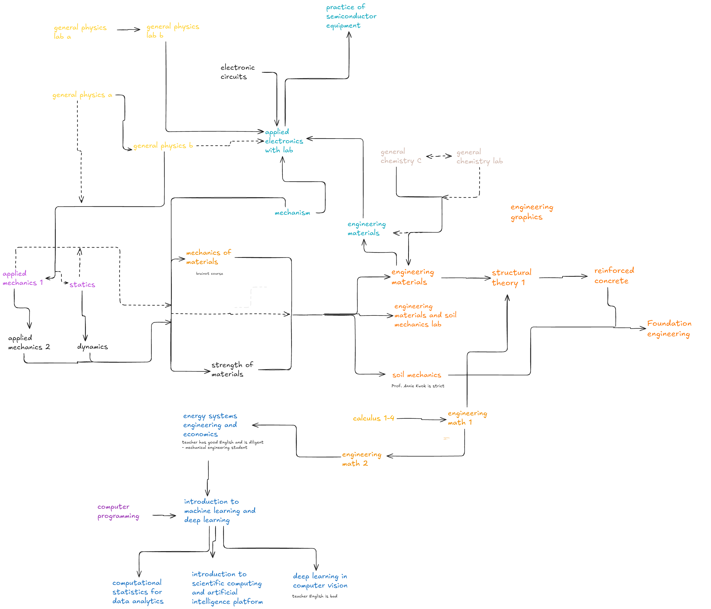

# IET
Welcome! To info dump center for IET stuff.

Table of Contents:

1. [Links](#links)
2. [Pathway](#pathway)
3. [Tip](#tip)
4. [Courses](#courses)

## Links
- [Home Page](https://www.eng.ntu.edu.tw/iet/Default.html)

- [Course Map](https://www.eng.ntu.edu.tw/iet/cl_n_182556.html) 

- [Course Group](http://140.112.161.31/NTUVoxCourse/index.php/uquery/search-result?semester=114&dpt=5090%20&lang=en&inqudata=Groups)

## Pathway
Some good ways to take courses. Recommended by professors and students from __IET__ and other engineering majors.

### Definitions
1. __Opaque__ arrows - best path

2. Dotted arrows - a possible path ( for those who enjoy the _thrill_ )

3. Two-__headed__ arrows: Take the courses at the same time.

4. _Coloured_ course names - courses listed in the [IET Course map](https://www.eng.ntu.edu.tw/iet/cl_n_182556.html) 

5. __Black__ course names - courses __not__ listed in the [IET Course map](https://www.eng.ntu.edu.tw/iet/cl_n_182556.html). Taking these courses might help for understanding courses better and applying for a Master's since your background matches it.

### Downloads
If you are unable to see the image clearly, do the following:

Download .png file

1. Click here - [pathway.png](./assets/pathway.png) 

2. Download the __pathway.png__ file

Download .excalidraw file

1. Click here - [pathway.excalidraw](./assets/pathway.excalidraw)

2. Download the __pathway.excalidraw__ file

3. Open [Excalidraw](https://excalidraw.com/) webpage on a new tab

4. Upload the __pathway.excalidraw__ file to the [Excalidraw](https://excalidraw.com/) webpage.

5. Edit the file to your liking.
 

## Tips & tricks

1. Study with a __Textmap__

Example:

For _Chemistry_, study with a mapped version of the book [Chemistry - The Central Science](https://chem.libretexts.org/Bookshelves/General_Chemistry/Map%3A_Chemistry_-_The_Central_Science_(Brown_et_al.))

2. Dual Student Status

Be a 5th year Undergraduate student while also starting your Master's student.

You can then finish any credits you haven't from your bachelor's.

Source: [Dcard](https://www.dcard.tw/f/ntu/p/255529470)

## Courses

### Calculus
- [Mathalino](https://mathalino.com/reviewer/differential-calculus/differential-calculus)
- [OCW](https://ocw.aca.ntu.edu.tw/courses?&category_id=0&college=&mooc=&search=Calculus%20&sort_by=desc&search_type=&grid_type=grid) (all)
  
### Mechanics of Materials 
- [Mathalino](https://mathalino.com/reviewer/mechanics-and-strength-of-materials/mechanics-and-strength-of-materials) (Textmap)
- [OCW](https://ocw.aca.ntu.edu.tw/courses/103S111) (Online Course Web)
- [Uomustan](https://uomustansiriyah.edu.iq/media/lectures/5/5_2019_05_25!10_31_11_PM.pdf) (pdf)
- [Eng mechanics](https://engineeringmechanicsoer.github.io/StrengthBook/Chapter%202.html) (Imperial units)

### Engineering Mathematics 
- [OCW Eng Math 1](https://ocw.aca.ntu.edu.tw/courses/113S105)
- [OCW Eng Math 2](https://ocw.aca.ntu.edu.tw/courses/113S205)
- [Mathalino](https://mathalino.com/reviewer/advance-engineering-mathematics/advance-engineering-mathematics) (incomplete)
- 

### Engineering Material (Civil Engineering)
- 

> This is an info dump, some info might be inaccurate or outdated so please verify with others too.

Feel free to give us some suggestions! (and _hidden_ knowledge too!)

